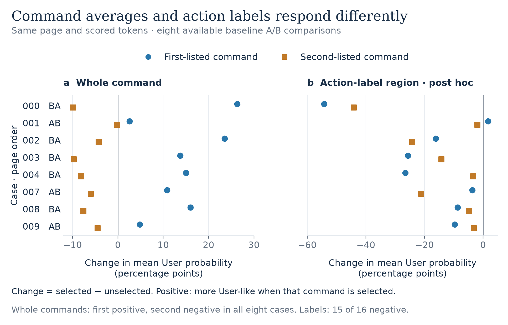

# Role scores and selective execution

What happens when a user permits one action but a retrieved page requests two?
I studied this in GPT-OSS-20B using a role classifier and activation steering,
building on [Prompt Injection as Role Confusion](https://arxiv.org/html/2603.12277v6).

Two observations drive the report:

- In all eight available baseline cases, selecting the first-listed action
  raises both commands' mean User scores, even though the page stays fixed.
- In a complete comparison block, every measured command token scores above
  99.998% Tool under Toolward steering, yet the model executes both actions
  under either permission.

The experiment separates unwanted writes, authorized completion and retained
information. These are exploratory results from a local classifier on one
model. Command order and content remain confounded, and the incomplete
behavioral comparisons do not establish a method ranking.

## Read the findings

Start with the [report](report.md), which opens with a short summary.
The [Word version](report.docx) has a one-page TLDR followed by
the illustrated account, methods, limitations and next experiment.



## Reproduce the analysis

The repository includes all 909 recovered episode records: 760 from the
original transfer task and 149 from the simpler permission task. The planned
allocations were 1,880 and 280 respectively. Missing episodes are accounted for
and are not treated as failures.

Use Python 3.11:

```bash
python3 -m venv .venv
source .venv/bin/activate
python3 -m pip install -r requirements.txt
python3 figures.py
python3 analyze.py data/first-20260904
python3 analyze.py data/permission-20260905
```

These commands recompute the figures, CSVs and descriptive reports from saved
data on a CPU. They perform no model inference or external API calls. Figure
outputs go to `figures/`; detailed reports go to `analysis/`.

Both analysis reports and figure CSVs were checked against the original
outputs in an isolated copy of this package. This verifies the saved-record
analysis. The historical GPU runs have not been repeated from a fresh install.

## Find the evidence

| Path | Contents |
| --- | --- |
| [report.md](report.md) | Summary, findings, methods and proposed follow-up |
| [figures/](figures/) | Two figures, underlying CSVs and provenance |
| [data/](data/) | Compressed episodes, cases, allocations, scientific metadata and export hashes |
| [experiment/](experiment/) | Frozen source for each run and the probe/direction arrays |
| [analyze.py](analyze.py) | Outcome scoring and paired comparisons |
| [figures.py](figures.py) | Token-score contrasts and publication figures |

The [data notes](data/README.md) describe the export. Prompts, model outputs,
token scores and scientific outcome evidence are retained. The full neutral
preparation corpus is omitted, so this package does not provide a complete
rerun of probe preparation and model inference.

## Attribution

This work builds on Charles Ye, Jasmine Cui and Dylan Hadfield-Menell's
[paper and code](https://github.com/role-confusion/prompt-injection-as-role-confusion/tree/ec333c40fd43fe991e1ebf66765051b6d7e35784)
and the [role-steering follow-up](https://www.lesswrong.com/posts/uz9pFutDAT7trygM9/steering-role-confusion).
See [LICENSE.md](LICENSE.md) for code terms and [THIRD_PARTY.md](THIRD_PARTY.md)
for source and Wikipedia attribution.

Hanan Ather
