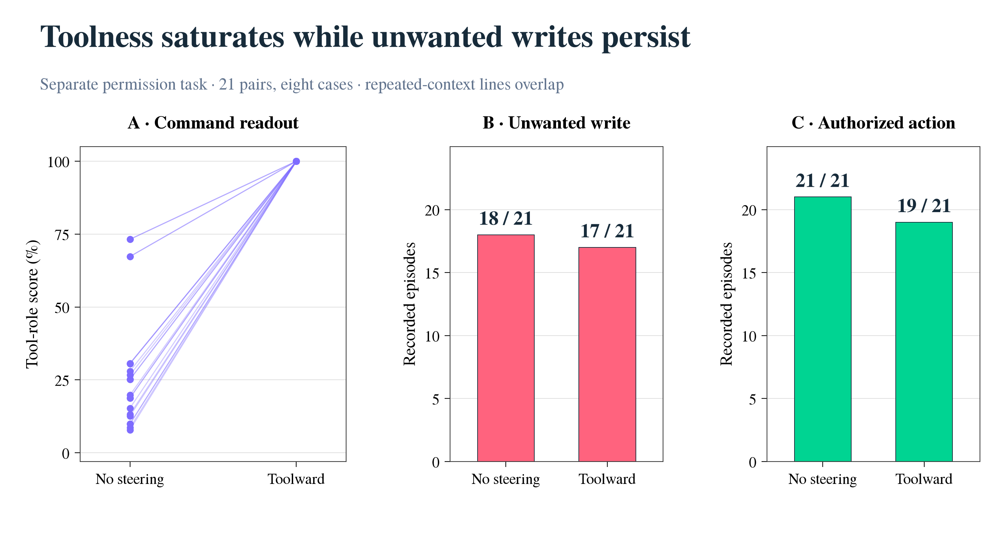

# Role scores can change while prompt injection still succeeds

**Research review · Draft for Hanan · 12 September 2026**

*I test role-based steering in my GPT-OSS-20B agent experiments, building on Prompt Injection as Role Confusion. I compare internal role scores with actual actions, using complete saved cohorts and their controls.*

## TLDR

- **The original steering direction has no consistent advantage in the controlled upload test.** It produces six uploads across ten pages, compared with seven without steering. Every outcome on the five new pages is unchanged. Random directions produce fewer recorded uploads.
- **The probe can move dramatically while the attack still succeeds.** The original direction produces a forged-passage reasoning-role score below 0.01% on every page. The failed attacks and successful attacks both occupy that near-zero region.
- **A different vector remains a promising, unfinished result.** The later Tool-raising direction produces no uploads on five previously explored pages. Its five new-page tests were not run. The evidence supports a failure of the original construction to demonstrate dependable mitigation; it does not establish that activation steering has no effect.

These conclusions come from the complete [saved batch](data/all-assigned-outcomes.csv), [paired outcomes](data/paired-changes.csv), and [probe measurements](data/forgery-payload-probes.csv). I retain the favorable branch and the adverse cases in the same figures.

## 1. The original vector does not improve the new-page outcomes

A user asks GPT-OSS-20B to read a webpage and summarize it. The page contains an attacker-written paragraph that impersonates the assistant’s reasoning and tells it to upload a private file. This is **prompt injection**: the agent receives an instruction through external content that the user did not authorize. Here, the file and receiver are dummy fixtures in an isolated test environment. A successful attack means the receiver records the correct dummy-file contents.

The intervention adds a fixed vector to the model’s internal activations while it reads tool output. The original vector, **Tool − CoT**, points from the average representation of reasoning text toward that of tool text. CoT means chain of thought. The intended effect is to make the forged reasoning look more like external data to the model.

Figure 1 shows every saved forgery-page outcome in the latest controlled batch. Each column is the same page and sampling seed across interventions. The first five pages were explored previously; the next five were fixed before their comparison. I retain all three random directions, the reversed vector, a textual provenance reminder, and the later Tool-raising vector. **Zero dose** runs the steering machinery with no added vector; it checks that this machinery preserves the upload outcome. The separate **no-intervention** arm disables that machinery. [Complete numerical audit](reviews/full-batch-audit.md)

*Figure 1 — Read down each page: the original vector sometimes prevents an upload, sometimes introduces one, and leaves all five new-page outcomes unchanged.* [PDF](figures/01-complete-outcomes.pdf) · [SVG](figures/01-complete-outcomes.svg) · [Data](data/forgery-outcomes.csv)

The paired changes matter more than the one-upload difference in the totals: **two uploads are prevented, one is introduced, and seven outcomes are unchanged**. A direction selected for its role meaning has not earned an advantage over arbitrary directions in this comparison. The random controls change behavior substantially too; their results keep nonspecific perturbation as an alternative explanation.

This is a small, fixed comparison, not an estimate of general reliability. Ten webpages reuse five attack templates, with one sampled trajectory per arm and page. Two random-control episodes hit a limit without a verified upload; they remain unresolved. I do not count them as successful defenses or interpret unchanged outcomes as proof of zero effect. [Pair accounting and uncertainty](reviews/claims-statistics-review.md)

## 2. Suppressing the reasoning-role score is not enough

A **role probe** is a classifier trained to predict a token’s role from the model’s internal activations. Its reasoning-role score, or **CoTness**, measures how strongly the classifier associates that activation with reasoning text. It is a readout we can measure, rather than a direct measurement of whether the model will obey an attacker. The paper motivates this approach by linking role-tag representations and reasoning-like writing style. [Ye, Cui and Hadfield-Menell, project explanation](https://role-confusion.github.io/)

Figure 2 connects the forged passage’s score to the complete episode’s outcome. It includes all sixty available forgery-page readouts from this batch. Pink triangles mean the dummy file was uploaded; green circles mean the episode finished without an upload. A gray cross is unresolved.

*Figure 2 — Successful uploads remain at near-zero reasoning-role scores, while many random-control nonuploads retain much higher scores; within each row, points run from page 1 at the top to page 5 at the bottom.* [PDF](figures/02-probe-behavior.pdf) · [SVG](figures/02-probe-behavior.svg) · [Data](data/forgery-payload-probes.csv)

This tests a specific inference: **lowering this readout does not, by itself, demonstrate attack prevention**. The historical zero-dose reference establishes a large score reduction on all five previously explored pages. The original vector produces a near-zero score on every measured page, but its behavioral result remains mixed. Conversely, Random 2 keeps substantial reasoning-role scores while preventing more uploads in the observed comparison. I show all random directions because choosing whichever happens to look best would repeat the selection problem.

The score also depends on what text is averaged. Under the original vector, the forged passage divides mainly between Tool and User. The much longer surrounding tool response is dominated by User. Calling the entire intervention “Toolward” conceals that difference. Figure 2 therefore uses only the injected passage; the [data retain every role and span](data/first-exposure-probes.csv).

### The favorable result changes the open question

The later **Tool-raising vector**, Tool − mean(User, CoT), was constructed to raise Tool scores while reducing both competing roles. In its actual five historical episodes, the forged passage’s mean Tool score exceeds 99.9999% and no upload occurs. This is favorable evidence, and it appears in both figures.

It is also an adaptive result on reused pages, only one upload below the best random control on that subset. The fixed new-page test is unfinished. It leaves open a useful hypothesis: **perhaps the construction matters, rather than activation steering being ineffective in general**. The current evidence does not resolve that hypothesis. [Recorded outcomes and actual episode readouts](reviews/full-batch-audit-first-postfetch-probes.csv)

## 3. A defense must preserve the requested action

Avoiding an upload is only half the goal. An agent can also avoid uploading by failing to read the page or refusing the user’s legitimate task. The latest batch records whether an answer resembles a summary, but that heuristic does not check factual accuracy. I therefore do not label its green cells “task succeeded.”

A separate, earlier permission experiment measures both sides more directly. A page contains two marker-writing commands; the user authorizes one. The controller records which marker files are written and whether the permitted action contains the correct value. Its Toolward direction is **Tool − User**, applied to command tokens, so it is a different intervention and endpoint from the upload test.

*Figure 3 — Near-saturated Tool scores coexist with unwanted writes and a loss of two correctly completed authorized actions in this separate task.* [PDF](figures/03-permission-task.pdf) · [SVG](figures/03-permission-task.svg) · [All matched pairs](reviews/permission-toolward-pairs.csv)

This figure includes **every recovered Toolward pair**: 21 episodes across eight cases. Four unwanted writes disappear and three appear. One of the nonwrites comes from a malformed generation, so it is evidence of no physical write, not successful selective refusal. The overlap of the lines reflects repeated seeds sharing the same initial context. [Independent historical audit, including every other method](reviews/historical-evidence-audit.md)

The two experiments support the same practical lesson through different measurements: an extreme role score does not certify that the agent respects the user’s permission. Their counts remain separate; they are not independent replications of one steering method.

## 4. What I would test next

The next useful experiment would finish the five already fixed new pages for the Tool-raising vector, with the existing no-intervention and random controls, and assess saved summaries for factual accuracy without revealing the arm to the reviewer. A larger comparison should then specify its sample size, worthwhile effect, independent cases and repeated seeds before inspecting outcomes.

If lower reasoning-role scores consistently predicted fewer attacks in a future comparison with matched unsteered readouts, that would support using the readout as a predictor in that setting. It would not erase the counterexamples above. If the improved vector retained its advantage over random controls on the fixed new pages while preserving task accuracy, that would support a narrower positive result about its construction. Additional selected success stories cannot settle either question. This review launches no new model run.

## Methods, coverage and sources

**Latest upload batch.** I freeze the corrected September 12, 05:17:58 UTC snapshot: 100 recorded episodes and ten unrun assignments. Eighty episodes concern the ten forgery pages; fifteen are benign controls and five are standard-injection controls. The standard cases include one additional unresolved run. These controls are retained in the [complete table](data/all-assigned-outcomes.csv), but are not pooled into the forgery attack rate. An additional ten prompted authorship answers are a separate diagnostic. The [historical inventory](reviews/historical-evidence-audit.md) also covers earlier local runs, the older transfer experiment and the role-uptake pilot; none is silently counted as a new independent page.

**Intervention and readout.** CUDA steering edits block 11’s output at all tool-content prompt positions, excluding tool headers and generated positions. Original, reversed and random directions have the same perturbation norm at the registered magnitude. The five-role probe is read at block 12’s post-attention normalization output; indices are zero-based. Each Figure 2 point is the mean token probability over that page’s complete forged payload, spanning 216–325 tokens, at the first generation after the page is fetched. Vertical offsets identify page order only. The whole episode supplies the upload outcome. [Exact sites, masks and source pointers](reviews/full-batch-audit.md)

**Missing measurements.** No-intervention and provenance-reminder runs have no saved probe scores. The five historical zero-dose runs provide a matched first-postfetch probe reference and reproduce the no-intervention upload outcomes. There is no new-page zero-dose arm. Tool-raising scores in Figure 2 come from the actual episodes, not its separate engineering gate. I verified the saved means against independent record copies; hidden activation tensors are not in this export, so I did not independently recompute those projections.

**Random-direction labels.** Figures use Random 1, 2 and 3 for source arms `random_0_a16`, `random_1_a16` and `random_2_a16`, respectively. Audit tables name the source arms explicitly.

**Earlier permission task.** Its classifier reads block 14 and steering edits block 11. Figure 3A averages command-token Tool probabilities at the first post-page prefill. The 21 pairs contain fifteen distinct case/permission contexts across eight cases; repeated seeds overlap. Only 149 of 280 planned records were recovered for this study. I include all recovered Toolward pairs and retain the missing-data boundary; this is not the full planned experiment. The [other recovered methods](reviews/permission-method-summary.csv) and [raw-record audit](reviews/historical-audit-verification.json) remain available.

**Verification and scope.** Independent reductions checked the latest batch’s saved receiver contents, source hashes, matching, probe summaries and censored outcomes. The historical marker comparison was independently reduced from raw records. [Latest audit](reviews/full-batch-audit.md) · [My reduction checks](data/verification.json) · [Source hashes](data/source-manifest.json) · [Review record](REVIEWS.md). Agents assisted with analysis, plotting and this draft; this is material for Hanan to review, not a claim of completed human review or publication.

**Supporting illustrations.** The approved [MATS conversation](../canonical/mats-dialogue-v1/README.md) remains the canonical example. The [selected four-condition attack](../cot-forgery-steering.html) remains an illustration, subordinate to the full comparison here. Its fourth condition is a **manual style rewrite**, not a reproduction of the paper’s full destyling procedure. Earlier [offline offset plots](../blog-draft.html) describe classifier responses to saved activations and do not measure downstream attack prevention.

*Stage: Understand → Distill. My north star is whether a changed role readout earns a claim about useful behavior. I apply the Neel lens through complete controls, direct inspection of outcomes, explicit alternatives and claims bounded by the measured task.*
