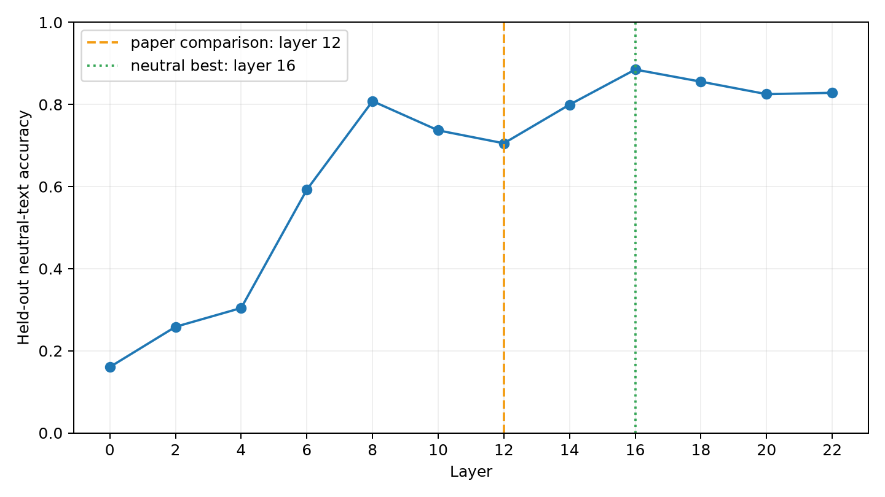
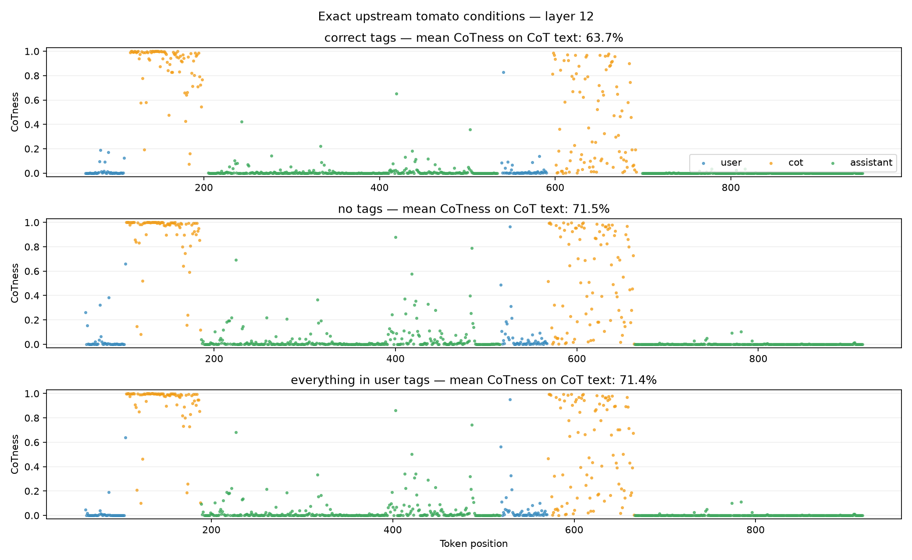
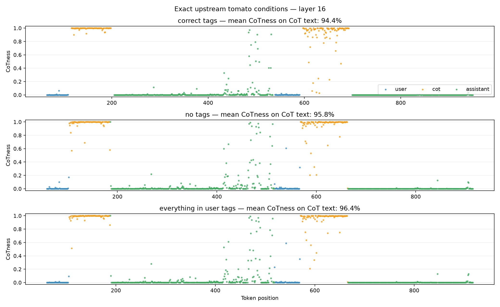

# Exact full role-probe reproduction — seed 123

## Outcome

The requested single-seed `gpt-oss-20b` pipeline completed on one H100. The
four-way system/user/CoT/assistant probe was trained at layers 0, 2, ..., 22
from pre-MLP activations. Layer 12 is retained as the fixed paper comparison;
layer 16 is selected independently because it has the highest held-out
neutral-text accuracy.

| Layer | Held-out accuracy |
|---:|---:|
| 0 | 0.1604 |
| 2 | 0.2584 |
| 4 | 0.3042 |
| 6 | 0.5925 |
| 8 | 0.8082 |
| 10 | 0.7369 |
| **12 (paper comparison)** | **0.7055** |
| 14 | 0.7996 |
| **16 (neutral-text best)** | **0.8851** |
| 18 | 0.8556 |
| 20 | 0.8252 |
| 22 | 0.8285 |

The selected layer was determined only from the held-out neutral C4/Dolma
tokens. Tomato/tag-condition results were not consulted during selection.

## Tomato tag conditions

The exact pinned `tomato.yaml`, modified GPT-OSS Jinja chat template, BOS
token, and upstream tomato separators were used for correct tags, no tags,
and the entire conversation inside user tags. Mean CoT probability on the
originally CoT-style passages was:

| Layer | Correct tags | No tags | Everything in user tags |
|---:|---:|---:|---:|
| **12** | 0.6366 | 0.7146 | 0.7138 |
| **16** | 0.9441 | 0.9581 | 0.9635 |

Plots for every other evaluated layer are retained in `plots/`.

## Exact settings and compatibility

- Upstream commit: `ec333c40fd43fe991e1ebf66765051b6d7e35784`
- Runner commit: `557c666b` on `codex/exact-role-probe`
- Model: `openai/gpt-oss-20b`, revision
  `6cee5e81ee83917806bbde320786a8fb61efebee`
- Data: 250 passages, 62 C4 and 188 Dolma 3, maximum 1,024 content tokens
- Seed: 123
- Split: upstream `prompt_ix`, 10% held out
- Probe: cuML L2 logistic regression, `C=0.005`, no scaling, 5,000 maximum
  iterations, 100 line-search iterations
- Activations: output of `post_attention_layernorm`, before the MLP
- Layers: 0, 2, ..., 22
- Rendered training roles and order: system, user, tool, CoT, assistant
- Probe roles: system, user, CoT, assistant

Because 250 cannot be divided into exact integer 25%/75% counts, the C4 count
was floored and the remaining passage assigned to Dolma (24.8%/75.2%). This
honors the requested total of 250. A literal evaluation of both independent
`int(n * fraction)` expressions in the upstream notebook would instead yield
62 + 187 = 249 passages.

The pinned custom forward used two Transformers interfaces that changed by
version 5.15: masking argument names and the location of per-layer attention
type metadata. Compatibility adapters restored those interfaces without
changing masking behavior. A paid-machine gate then established bit-identical
logits and bit-identical pre-MLP states between the adapted pinned forward and
the hook capture at all 12 retained layers. See `pre-mlp-validation.json`.

cuML reported line-search stopping warnings at several layers. The exact fixed
upstream hyperparameters were retained rather than tuned after seeing results.
Every saved logit and probability was subsequently checked for finiteness and
every probability row was checked to sum to one.

## Integrity and artifacts

Independent verification established:

- activation tensor shape: `716970 × 12 × 2880`, float16;
- activation file size: 49,556,968,368 bytes;
- held-out tokens per layer: 54,639;
- 12 raw held-out logit/probability files with shape `54639 × 4` each;
- 32,940 tomato token-layer projection rows;
- 13 nonempty plots;
- confusion-matrix totals equal held-out totals at every layer;
- every immutable artifact passes its recorded SHA-256 digest.

Large artifacts remain on persistent storage at:

`/workspace/role-probe-storage/outputs/exact-full-pipeline-seed123-v3`

These include the 49.56 GB activation tensor, serialized probes, raw held-out
logits and probabilities, full tomato token projections, token index, dataset
passages, manifests, and SHA-256 list. The experiment log is at:

`/workspace/role-probe-storage/logs/exact-full-pipeline-seed123-v3.log`

This repository report contains the reviewable metrics, metadata, and plots.
The earlier demo-derived `reports/2026-08-25-h100/` results were not modified.
No additional seeds were started.

