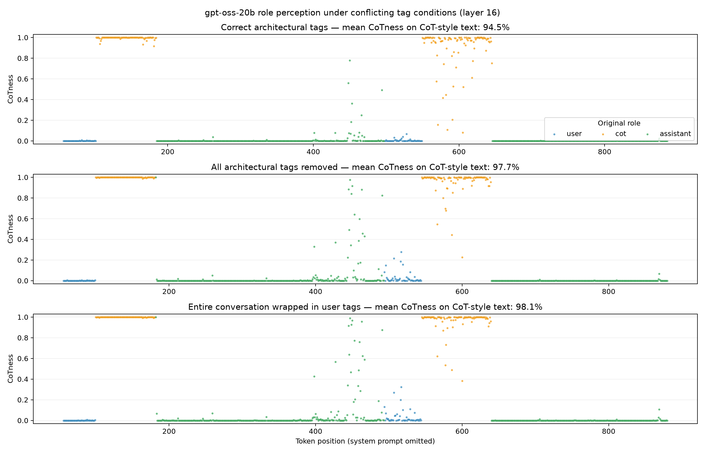
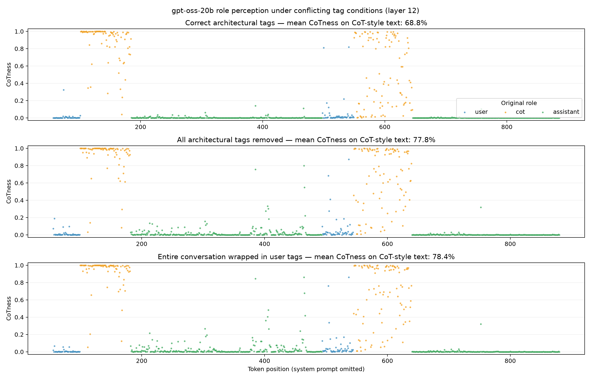

# H100 probe reproduction — 2026-08-25

## Outcome

The probe-only `gpt-oss-20b` demonstration completed end to end on one H100.
Role identity becomes strongly linearly decodable in later layers, peaking at
0.874 accuracy for the upstream-style split and 0.896 for the grouped-by-source
split. Four-way chance accuracy is 0.25.

| Layer | Upstream-style `prompt_ix` split | Grouped `base_seq_ix` split |
|---:|---:|---:|
| 0 | 0.134 | 0.322 |
| 4 | 0.277 | 0.539 |
| 8 | 0.787 | 0.860 |
| 12 | 0.677 | 0.798 |
| 16 | **0.874** | **0.896** |
| 20 | 0.815 | 0.857 |

The grouped split keeps all role-rendered copies of a source passage on the
same side of the train/test boundary. It performed better at every layer in
this run, so identical-content overlap in the upstream-style split does not
explain the late-layer decoding result here. The upstream-style split is not
class-balanced by construction, which may contribute to its lower and noisier
accuracy.

## Correct, absent, and conflicting tags

We also applied the trained probe to the authors' published gardening case
study under three conditions: correct Harmony tags, no tags, and the complete
conversation wrapped in a single user message. The plotted colors retain each
passage's original semantic role even when its architectural tag is removed or
changed.

At layer 16, the probe assigns CoT-style passages mean CoT probabilities of
0.945 with correct tags, 0.977 without tags, and 0.981 when everything is
wrapped in user tags. This reproduces the post's qualitative result: reasoning
style remains strongly represented in the probe direction when tags are absent
or conflict with the text.

The paper visualizes the middle layer (layer 12 for this model). Our reduced
150-passage, 512-token probe is substantially weaker there: CoT-style means are
0.492, 0.608, and 0.620 for the same three conditions. Consequently, layer 16
is the clearer reproduction plot, but it must not be presented as an exact
replication of the paper's layer-12 result. Both plots, token-level projection
CSVs, summaries, and metadata are retained in `tag-conditions-layer12/` and
`tag-conditions-layer16/`.

## Paper-sized rerun

We subsequently retrained with the paper's stated data scale: 250 base
passages, 1,024 content tokens, and approximately 1,250 role-wrapped sequences.
Batch size was reduced to 16. All other probe settings and the upstream-style
`prompt_ix` split were retained.

| Layer | Held-out accuracy | Correct-tag CoTness | No-tag CoTness | All-user-tag CoTness |
|---:|---:|---:|---:|---:|
| 0 | 0.164 | 0.307 | 0.267 | 0.266 |
| 4 | 0.286 | 0.763 | 0.740 | 0.722 |
| 8 | 0.737 | 0.840 | 0.881 | 0.894 |
| 12 | 0.635 | 0.688 | 0.778 | 0.784 |
| 16 | **0.844** | **0.943** | **0.971** | **0.976** |
| 20 | 0.793 | 0.711 | 0.645 | 0.651 |

Layer 16, not layer 12, is the best held-out classifier in this reproduction.
The paper's layer-12 choice should therefore be interpreted as a fixed
mid-layer measurement point, not as a claim that it maximizes classification
accuracy. At layer 12, increasing the dataset size moves our condition means
closer to the paper's reported 0.85, 0.83, and 0.85, but does not fully recover
them.

The full layer accuracy table is in `full-paper-size/probe-accuracy.csv`. The
six-layer token projections and summaries are in
`full-paper-size-tag-conditions/`; the serialized probes and executed notebook
remain on persistent remote storage.

## Experiment settings

- Upstream code snapshot: `ec333c40fd43fe991e1ebf66765051b6d7e35784`
- Local project commit used for final runs: `a14bc6c575edf81053c9f17feb9747fb6f187c5f`
- Model: `openai/gpt-oss-20b`
- Model revision: `6cee5e81ee83917806bbde320786a8fb61efebee`
- Source data: 150 passages, half C4 and half Dolma 3
- C4 revision: `f3b95a11ff318ce8b651afc7eb8e7bd2af469c10`
- Dolma 3 revision: `3a8349c`
- Maximum source length: 512 tokens
- Rendered roles: system, user, CoT/analysis, assistant, and tool
- Probe classes: system, user, CoT/analysis, and assistant
- Layers: 0, 4, 8, 12, 16, and 20
- Batch size: 32
- Seed: 123
- Probe: cuML L2 logistic regression, `C=5e-3`, maximum 2,000 iterations
- Captured activation matrix at each retained layer: 266,005 × 2,880
- First-batch diagnostic perplexity: 216.89

## Environment

- GPU: NVIDIA H100 80GB HBM3 (79.18 GiB visible)
- Driver: 580.126.09
- Python: 3.12.14
- PyTorch: 2.9.1+cu128
- Transformers: 5.15.1
- Datasets: 5.0.1
- CuPy: 14.2.0
- cuML: 25.10.00
- scikit-learn: 1.7.2

See `environment/h100-diagnostics.json` and
`environment/requirements-freeze.txt` for the captured machine and package
details.

## Compatibility changes from the pinned upstream setup

The upstream files were preserved unchanged under `vendor/upstream`. The
generated runnable notebook and setup required these compatibility changes:

- Transformers 5 instead of the upstream setup script's contradictory 4.57.5.
- `kernels==0.16.0`, required by Transformers 5.15 for MXFP4 and the requested
  hub attention kernel.
- RAPIDS cuDF/cuML 25.10.0 because the upstream 25.9 build was unavailable as a
  released package.
- scikit-learn 1.7.2 because cuML 25.10 is incompatible with scikit-learn 1.9.
- `zstandard` for streaming the pinned Dolma 3 files.
- C4's pinned `en/` directory selected with `data_dir="en"` under Datasets 5.
- The virtual environment placed on pod-local disk; model cache, diagnostics,
  and results remained on the RunPod network volume.

## Artifacts

Small, reviewable artifacts copied into this report:

- `baseline-prompt-split/probe-accuracy.csv`
- `grouped-source-split/probe-accuracy.csv`
- `smoke/probe-accuracy.csv`
- `environment/h100-diagnostics.json`
- `environment/requirements-freeze.txt`

The executed notebooks and serialized probe objects remain on persistent remote
storage under `/workspace/role-probe-storage/outputs/`. Probe pickle files must
only be loaded from this trusted experiment.

## Limitations and next checks

This reproduces the authors' lightweight demonstration settings, not the full
paper's hyperparameter search. The result is a single seed. Next steps should
include multiple seeds, confusion matrices and per-class metrics, then training
the full 250-passage, 1024-token probe to test whether the published layer-12
gardening values can be recovered.
