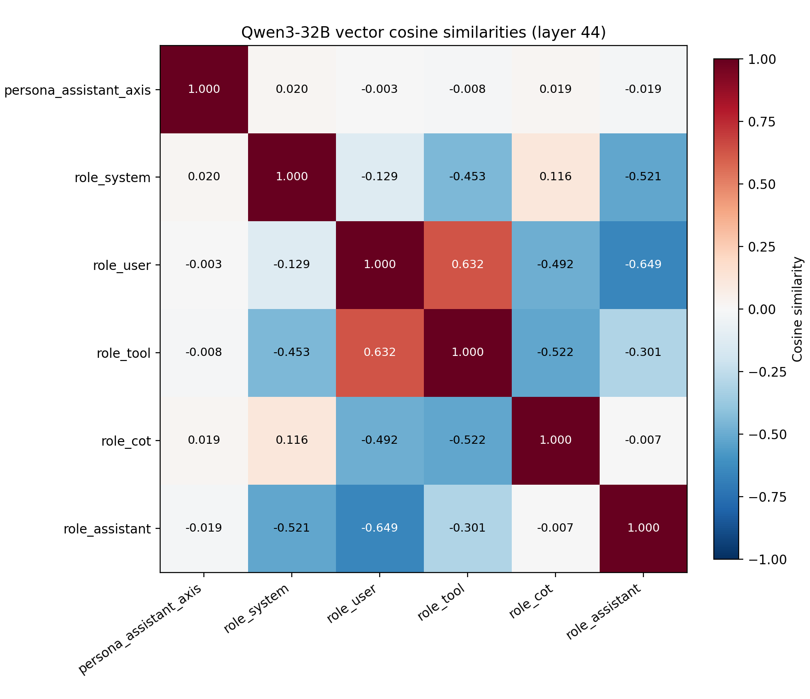

# Qwen3-32B paper-style tag-induced role probes

This report contains the corrected Qwen3-32B role-probe run modeled on
Appendix G of Ye, Cui, and Hadfield-Menell (2026), arXiv:2603.12277v6.  It
replaces rich, role-specific conversational histories with controlled
architectural-role renderings of identical neutral target text.  No text was
generated and no behavioral experiment was run.

## Data and prompt construction

- Seed: 123.
- 250 distinct neutral base sequences: 62 C4 (24.8%) and 188 Dolma3 (75.2%).
  This is the nearest integer allocation to 25%/75% that retains exactly 250
  bases and matches the previously saved corpus.
- Maximum target length: 1,024 tokens.
- Five renderings per base: system, user, tool, CoT, and assistant-final, for
  1,250 rendered sequences total.
- Total target-content token rows: 723,356.  All target tokens were retained;
  role-tag and filler activations were excluded.

Qwen nests thinking and final-answer text in one assistant block.  Following
the paper, assistant-final targets were placed after a variable-length neutral
filler thought.  The matched filler was placed before the role tags in the
system, user, tool, and CoT variants to control the target's absolute position.
Each filler came from a different neutral base sequence, was at most 512
tokens, and its hidden states were discarded.

## Probe fitting

- Activation site: decoder-layer output after the full Qwen block.  This is the
  same 5,120-dimensional coordinate system as the downloaded assistant-persona
  axis.
- Layers: 0, 4, ..., 60.
- Classifier: five-way cuML multinomial logistic regression, L2 penalty, no
  feature standardization, 5,000 maximum iterations.
- Split: seeded 90%/10% over rendered prompts, matching the published training
  notebook's implementation.
- Regularization grid at the middle probed layer (28):
  `C in {1e-4, 1e-3, 1e-2, 1e-1, 1, 10, 100, 1000}`.  Minimum held-out NLL
  selected `C=1e-4`.
- Layer selection: maximum held-out token accuracy, with lower layer breaking
  ties.
- Role directions: each selected multinomial coefficient minus the mean
  coefficient across the five classes.

The standalone runner is `scripts/run_qwen_paper_tag_role_probes.py`.

## Selected-layer probe result

Layer **44** was selected:

| Metric | Value |
|---|---:|
| Held-out accuracy | 0.371908 |
| Balanced held-out accuracy | 0.377346 |
| Held-out NLL | 1.469405 |
| Train target tokens | 653,387 |
| Held-out target tokens | 69,969 |

Per-role held-out accuracy at layer 44:

| Role | Accuracy | Held-out tokens |
|---|---:|---:|
| System | 0.435338 | 9,627 |
| User | 0.367891 | 13,118 |
| Tool | 0.148568 | 17,184 |
| CoT | 0.251794 | 14,071 |
| Assistant | 0.683136 | 15,969 |

Five-way chance is 20%.  Layer 48 was nearly tied at 0.371450 raw accuracy;
layer 60 reached 0.364190.

## Assistant-persona-axis comparison

At layer 44, cosine similarity between the Lu et al. assistant-persona axis
and each centered tag-induced role coefficient was:

| Role direction | Cosine with persona assistant axis |
|---|---:|
| System | 0.020281 |
| User | -0.003415 |
| Tool | -0.008361 |
| CoT | 0.018934 |
| Assistant final | -0.018852 |

The maximum absolute cosine was 0.020281 (system).  The saved numerical arrays
are finite, have shapes `(16, 5, 5120)` and `(6, 5120)`, and the maximum
absolute residual after summing the five centered class coefficients is
`1.49e-8`.

## Interpretation and limitations

This is the requested tag-controlled construction, but its held-out accuracy is
only modestly above chance and tool accuracy is below chance.  cuML also emitted
L-BFGS line-search early-stop warnings for many fits.  Consequently, this run
does **not** satisfy the paper's stated criterion of high in-distribution probe
accuracy, and zero-shot generalization to real Qwen3-32B conversations was not
tested.  The near-zero persona-axis cosines are therefore descriptive of these
fitted coefficients, not strong evidence that the persona axis is orthogonal to
a validated Qwen role space.

The paper's published Qwen experiment used Qwen3-30B-A3B; this run adapts its
nested-tag method to dense Qwen3-32B so the probe vectors can be compared with
the available Qwen3-32B persona axis.

## Files

- `all-layer-paper-role-probe-vectors.npz`: centered five-class coefficients
  and intercepts for all 16 layers.
- `centralized-paper-role-vectors.npz`: selected-layer role vectors and persona
  axis.
- `probe-accuracy.csv`, `per-class-accuracy.csv`, and
  `regularization-grid.csv`: held-out metrics and hyperparameter search.
- `cosine-similarity.csv` and `cosine-similarity-heatmap.png`: selected-layer
  vector comparison.
- `prompt-manifest.csv`, `prompt-split.csv`, and `prompt-summary.json`: prompt,
  source, filler-position, and split metadata.
- `run-metadata.json`, `smoke-validation.json`, and `layer-selection.json`:
  reproducibility and validation details.
- `sha256sums.txt`: hashes of the immutable run artifacts copied from Cambria.

Persistent Cambria output:

`/workspace/role-probe-storage/outputs/qwen3-32b-paper-tag-role-probes-seed123-v2-20260826`

Run log:

`/workspace/role-probe-storage/logs/qwen3-32b-paper-tag-role-probes-seed123-v2-20260826.log`
